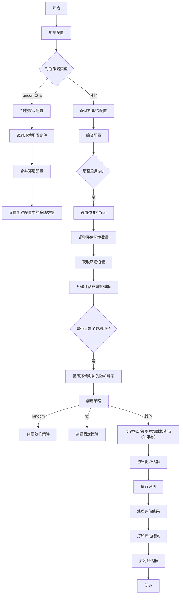

根据提供的`main`函数代码，可以将整个评估流程分为几个主要部分，并绘制出详细的流程图。以下是各个步骤的简要描述和对应的流程图。

### 流程图

### 主要步骤说明

1. **加载配置**：
   - 根据命令行参数中指定的策略类型选择不同的配置加载方式。
     - 如果策略类型是`random`或`fix`，则加载默认配置并读取环境配置文件。
     - 否则，调用`get_sumo_config`函数获取SUMO配置。

2. **编译配置**：
   - 将配置编译成最终的配置对象。
   - 如果启用了GUI，则设置环境配置中的GUI选项为`True`。
   - 调整评估环境的数量和每个评估周期的评估次数。

3. **创建评估环境管理器**：
   - 获取环境设置并创建评估环境管理器。

4. **设置随机种子**（如果提供了种子）：
   - 设置评估环境和包的随机种子以确保结果可复现。

5. **创建策略**：
   - 根据策略类型创建相应的策略对象。
     - 对于`random`策略，创建一个随机策略。
     - 对于`fix`策略，创建一个固定策略。
     - 对于其他策略类型，创建指定策略并加载检查点（如果有）。

6. **初始化评估器**：
   - 使用配置、评估环境和策略初始化评估器。

7. **执行评估**：
   - 使用评估器执行评估，并获取评估结果。

8. **处理评估结果**：
   - 处理评估结果，提取最终评估奖励。

9. **打印评估结果**：
   - 打印评估结果到控制台。

10. **关闭评估器**：
    - 关闭评估器以释放资源。

这个流程图详细地展示了`main`函数的执行顺序和逻辑分支，帮助理解整个评估过程的工作流。