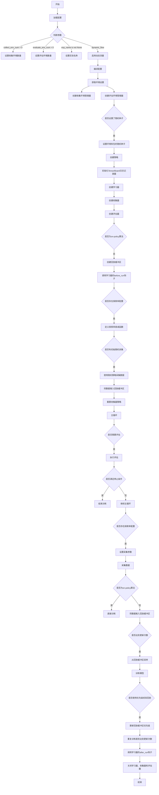

根据提供的`main`函数代码，可以将整个流程分为几个主要部分，并绘制出详细的流程图。以下是各个步骤的简要描述和对应的流程图。

### 流程图



### 主要步骤说明

1. **加载配置**：
   - 从命令行参数中加载配置。
   - 根据命令行参数修改配置项（如环境数量、实验名称等）。

2. **编译配置**：
   - 将配置编译成最终的配置对象。

3. **创建环境管理器**：
   - 创建用于数据收集和评估的环境管理器。

4. **设置随机种子**（如果提供了种子）：
   - 设置环境和包的随机种子以确保结果可复现。

5. **创建策略**：
   - 初始化策略对象，包括学习模式、收集模式和评估模式。

6. **初始化日志记录器**：
   - 使用TensorBoard记录训练过程中的日志。

7. **创建学习器、收集器和评估器**：
   - 初始化学习器、数据收集器和评估器。

8. **主循环**：
   - **评估**：在每个训练迭代中检查是否需要评估当前策略性能。
   - **数据采集**：根据配置采集新的数据。
   - **训练**：如果是off-policy算法，则将新数据推入回放缓冲区，并从中采样进行训练；如果是on-policy算法，则直接使用新数据进行训练。
   - **更新回放缓冲区优先级**（如果有）。

9. **结束训练**：
   - 调用学习器的`after_run`钩子。
   - 关闭所有资源（学习器、收集器、评估器）。

这个流程图详细地展示了`main`函数的执行顺序和逻辑分支，帮助理解整个训练过程的工作流。


### Registry 的原理和用法

`Registry` 是一种设计模式，用于管理和注册类、函数或其他对象。它允许你通过名称或标识符来查找和实例化这些对象，而无需直接导入或引用它们。这在构建模块化、可扩展的系统时非常有用，尤其是在需要动态加载组件的情况下。

#### 原理

1. **注册表**：`Registry` 是一个容器（通常是字典），用于存储键值对。键是唯一的标识符（如字符串），值是对应的类、函数或对象。
2. **注册机制**：提供方法将类、函数等对象注册到注册表中。通常使用装饰器或显式调用来实现。
3. **查找机制**：提供方法根据键从注册表中查找并返回相应的对象。

#### 用法

以下是一个简单的 `Registry` 类的实现及其用法示例：

```python
class Registry:
    def __init__(self):
        self._registry = {}

    def register(self, name, obj):
        """注册对象"""
        if name in self._registry:
            raise ValueError(f"Name {name} is already registered.")
        self._registry[name] = obj

    def get(self, name):
        """获取已注册的对象"""
        return self._registry.get(name)

    def has(self, name):
        """检查是否已注册"""
        return name in self._registry

# 使用装饰器简化注册过程
def registry_decorator(registry, name):
    def decorator(cls):
        registry.register(name, cls)
        return cls
    return decorator

# 创建一个全局注册表实例
global_registry = Registry()

# 使用装饰器注册类
@registry_decorator(global_registry, 'model1')
class Model1:
    def __init__(self):
        print("Model1 initialized")

@registry_decorator(global_registry, 'model2')
class Model2:
    def __init__(self):
        print("Model2 initialized")

# 动态创建实例
if __name__ == "__main__":
    model_name = 'model1'
    if global_registry.has(model_name):
        model_class = global_registry.get(model_name)
        model_instance = model_class()  # 输出: Model1 initialized
```

#### 在你的代码中的应用

在你提供的 `Registry` 实现中，`Registry` 可能被用来管理各种组件，例如策略（Policy）、环境（Environment）、优化器（Optimizer）等。具体实现可能会更复杂，包含更多的功能和约束。

假设你在 `ding.utils.registry_factory.py` 中有一个类似的 `Registry` 实现，以下是可能的用法示例：

```python
from ding.utils.registry_factory import POLICY_REGISTRY, ENV_REGISTRY

# 注册策略
@POLICY_REGISTRY.register('')
class PPOPolicy:
    def __init__(self, config):
        self.config = config
        print(" Policy initialized")

# 注册环境
@ENV_REGISTRY.register('sumo_env')
class SUMOEnv:
    def __init__(self, config):
        self.config = config
        print("SUMO Environment initialized")

# 动态创建策略和环境实例
if __name__ == "__main__":
    policy_config = {'learning_rate': 0.001}
    env_config = {'map_size': 100}

    policy_class = POLICY_REGISTRY.get('')
    policy_instance = policy_class(policy_config)  # 输出:  Policy initialized

    env_class = ENV_REGISTRY.get('sumo_env')
    env_instance = env_class(env_config)  # 输出: SUMO Environment initialized
```

#### 优点

- **模块化**：不同模块可以独立开发和测试，只需确保它们遵循注册表的接口规范。
- **扩展性**：可以轻松添加新的组件，而无需修改现有代码。
- **灵活性**：可以在运行时动态选择和实例化组件，提高系统的灵活性和适应性。

#### 注意事项

- **唯一性**：确保每个注册的键是唯一的，避免覆盖已有的注册项。
- **性能**：对于频繁使用的注册表，考虑使用更高效的查找方式（如哈希表）。
- **线程安全**：如果注册表会在多线程环境中使用，确保其操作是线程安全的。

希望这能帮助你理解 `Registry` 的原理和用法。如果你有更多问题或需要进一步的例子，请告诉我！