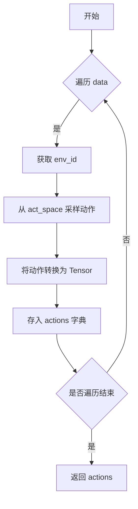

### 代码功能解释

这段代码定义了一个函数 `get_random_sample_func`，它返回一个内部函数 `_forward`。`_forward` 函数接收一个字典 `data` 和其他可选参数，返回一个包含随机动作的字典。具体步骤如下：

1. 定义外部函数 `get_random_sample_func`，接收参数 `act_space`。
2. 内部定义 `_forward` 函数，接收 `data` 字典及可选参数。
3. 初始化空字典 `actions`。
4. 遍历 `data` 中的每个环境ID (`env_id`)。
5. 对每个 `env_id`，从 `act_space` 中采样一个随机动作，并将其转换为 `torch.LongTensor` 类型。
6. 将处理后的动作存入 `actions` 字典中。
7. 返回 `actions` 字典。

### 控制流图 (CFG)

这个控制流图展示了 `_forward` 函数的执行流程，包括遍历输入数据、采样动作、转换动作类型以及最终返回结果的过程。

### 代码解释

这段代码定义了一个名为 `RandomPolicy` 的类，用于实现随机策略。以下是该类的主要功能和方法的解释：

1. **类注册**：
   - 使用装饰器 `@POLICY_REGISTRY.register('smartcross_random')` 将该类注册为名为 `smartcross_random` 的策略。

2. **类属性**：
   - `config = dict()`：初始化一个空字典作为配置项。

3. **构造函数 (`__init__`)**：
   - 接收参数 `act_space` 并将其赋值给实例变量 `self._act_space`。
   - `act_space` 是动作空间对象，通常是一个 Gym 环境的动作空间（如 `gym.spaces.Discrete` 或 `gym.spaces.Box`），用于生成随机动作。

4. **重置方法 (`reset`)**：
   - 不做任何操作，直接返回。

5. **获取随机动作 (`get_random_action`)**：
   - 调用 `self._act_space.sample()` 生成随机动作。
   - 将生成的动作转换为 `torch.LongTensor` 类型，并返回。

6. **前向传播 (`forward`)**：
   - 接收输入数据 `data`，其键是环境ID，值是其他信息。
   - 遍历 `data` 中的每个环境ID，调用 `get_random_action` 获取随机动作。
   - 将每个环境ID对应的动作存入输出字典 `output` 中。
   - 返回包含所有环境ID及其对应动作的字典。

7. **默认配置 (`default_config`)**：
   - 类方法，返回一个基于类配置的深拷贝，并设置 `cfg_type` 属性为类名加上 "Dict"。

### `act_space` 格式说明

`act_space` 是一个动作空间对象，通常是来自 Gym 库中的动作空间类型，例如：

- **离散动作空间**：`gym.spaces.Discrete(n)`，表示有 `n` 个离散的动作选项。
- **连续动作空间**：`gym.spaces.Box(low, high, shape)`，表示动作是一个在 `low` 和 `high` 之间的多维连续值。

具体来说，`act_space.sample()` 方法会根据动作空间的类型生成一个随机的动作样本。例如：

- 如果 `act_space` 是 `Discrete(5)`，那么 `act_space.sample()` 可能返回一个整数，如 `3`。
- 如果 `act_space` 是 `Box(-1, 1, (2,))`，那么 `act_space.sample()` 可能返回一个形状为 `(2,)` 的数组，如 `array([0.5, -0.8])`。

在 `get_random_action` 方法中，生成的动作会被转换为 `torch.LongTensor` 类型，以适应深度学习框架的要求。